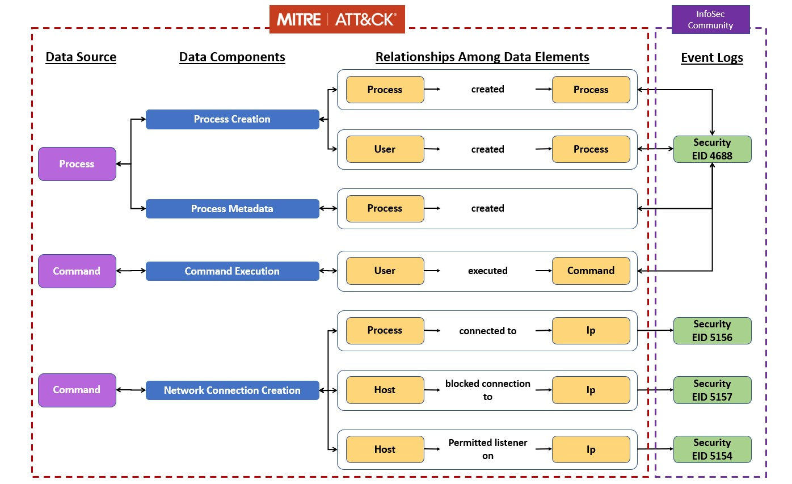
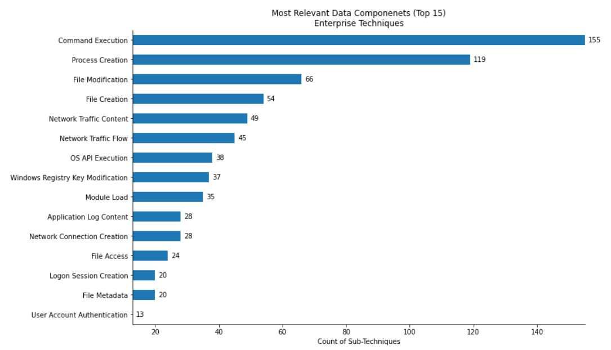
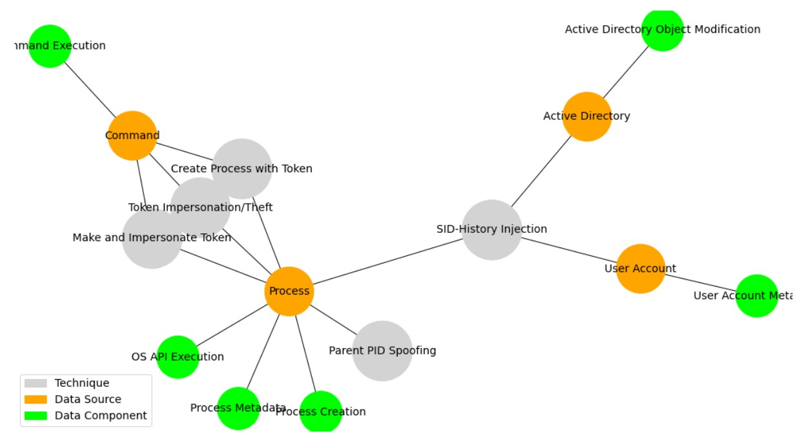
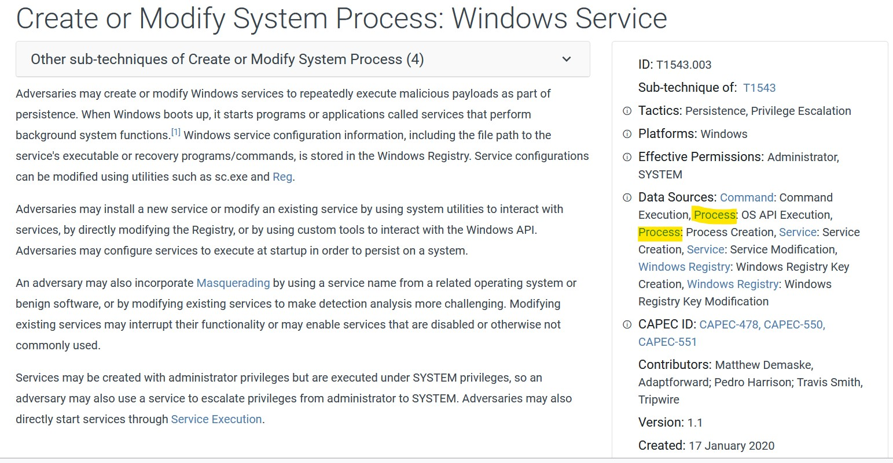
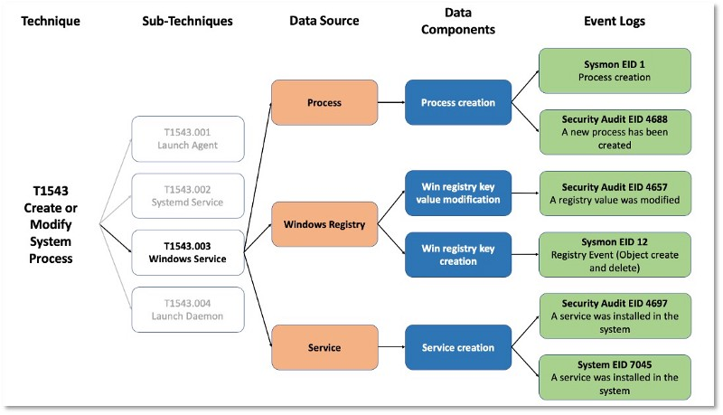

# ATT&CK Data Sources
As part of the [**ATT&CK 2021 Roadmap**](https://medium.com/mitre-attack/att-ck-2021-roadmap-68bab3886fa2), we have defined a methodology that will help improve how ATT&CK maps adversary behaviors to detection data sources. The idea behind this methodology is to improve quality and consistency of ATT&CK data sources as well as to provide additional information to help users make better use of these values.



The previous image shows only some of the elements that the methodology brings out such as *data components* and *relationships*, however it represents the main goal of this project: **better connect the defensive data in ATT&CK with how operational defenders analyze potential adversaries/ behaviors**.

## **Assembling ATT&CK Data Source Objects**
During the development of this project we have identified data sources' context that can help us to describe the activity within a network environment. We have decided to formalize all this contex thorugh the definition of **Data Source Objects** within the ATT&CK Object Model. The objects' strcuture is represented in the following image:


If you are interested on getting a better understanding of the concepts and methodology we have developed so far, please review the following documents and blogs we have prepared for you:

* [A Methodology to define ATT&CK Data Sources Objects](https://github.com/Cyb3rPandaH/attack-datasources/docs/methodology.md)
* [Defining ATT&CK Data Sources, Part I: Enhancing the Current State](https://medium.com/mitre-attack/defining-attack-data-sources-part-i-4c39e581454f)
* [Defining ATT&CK Data Sources, Part II: Operationalizing the Methodology](https://medium.com/mitre-attack/defining-attack-data-sources-part-ii-1fc98738ba5b)
* [Data Sources, Containers, Cloud, and More: What’s New in ATT&CK v9?](https://medium.com/mitre-attack/attack-april-2021-release-39accaf23c81)
* [ATT&CK 2021 Roadmap](https://medium.com/mitre-attack/att-ck-2021-roadmap-68bab3886fa2)

## **How Data Source Objects Can Support Security Operations?**

### **Identification of Relevant Data Sources and Components**
A common questions regarding ATT&CK data sources is *What data source or component can help me to develop detections for most techniques?* The definition of coverage metrics is something the community has been working on since the initial release of the framework. Therefore, measuring the number of techniques per data source is always a good starting point.



The image above shows that, considering all platforms and tactics within the Enterprise matrix, *command execution*, *process creation*, and *file modification* are a good starting point when analyzing most (sub)techniques.

### **Identification of Relevant Data Sources and Components: A Network Perspective**
Another way to represent the interaction among techniques, data sources and components is by using a network graph. Using *Python* libraries such as *NetworkX* and *Matplotlib*, we can create a visualization that will support our analysis.



The image above shows the interaction among sub-techniques and recommended data sources and components under [T1134 - Access Token Manipulation](https://attack.mitre.org/techniques/T1134/) technique for Desense Evasion (Tactic) in Windows (Platform) environments.

### **Representation of Adversary Behavior**
Data components gives us context of the activity or metadata related to network security concepts recommended as data sources by the ATT&CK framework.

For instance, let's say the *Process* data source is recommended for the detection of *T1543.003 Create or Modifiy System Process / Windows Service* technique. Without any other security context, the first question that might come to your mind is *what information about a process is required?*. The following image shows some of the available option by using components:


Each data component represents activity and/or information generated within a network environment because of actions or behaviors performed by a user or a potential adversary. The ATT&CK framework (v9) now provides data components that can help you to represent specific actions or behaviors related to a technique. According to the framework, the **creation of processes** and **execution of operating system's API calls** are a good starting point from a Process perspective.



### **Identification of Relevant Security Events**
At the beginning of this document, we mentioned that the main goal of this project was to **connect the defensive data in ATT&CK with how operational defenders analyze potential adversaries/ behaviors**. Even though the scope of this project does not consider mapping security events to data components and relationships, we believe that the information provided by data source objects can help you to identify relevant security data that should be collected in your environemnt in order to expedite the development of effective detections.



For example, the framework considers *Process/Process Creation* s a recommended data source for *[T1543.003 - Create or Modify System Process: Windows Service](https://attack.mitre.org/techniques/T1543/003/)* technique. The most important  question here is *What security events logs can give me context about the creation of a process?*. For Windows platform environments, Security Auditing event 4688 and Sysmon event 1 can help us to cover this data source recommendation. The image above shows an example of security events mapped to other recommended data sources for the same technique.

## **Where are the New Data Sources Objects Stored?**
V9 of the ATT&CK framework contains only data components as part of the new metadata for sata sources. However, you can find our current Data Source Objects [here](https://github.com/mitre-attack/attack-datasources/tree/main/contribution). We are storing this new metadata using YAML files, but in the future it will be store within our TAXII Server in STIX format.

```yaml
name: Process
definition: Information about instances of computer programs that are being executed by at least one thread.
collection_layers:
  - host
platforms:
  - Windows
  - Linux
  - macOS
contributors: 
  - ATT&CK
  - CTID
data_components:
  - name: process creation
    type: activity
    description: A process was created.
    relationships:
      - source_data_element: user
        relationship: created
        target_data_element: process
      - source_data_element: process
        relationship: created
        target_data_element: process
  - name: OS api execution
    type: activity
    description: A process executed operating system api functions.
    relationships:
      - source_data_element: process
        relationship: executed
        target_data_element: api call
references:
  - https://docs.microsoft.com/en-us/windows/win32/procthread/processes-and-threads
```

## **How can you Consume Data Source Objects Content?**
The idea of storing all this data using **YAML** files is to facilitate the consumption of data source objects content until we move everything to our TAXII Server. So, feel free to use any tool that can handle yaml files and that is available for you. We have prepared a Jupyter notebook using libraries such attackcti, pandas, and yaml to give you an example of how can you gather up-to-date ATT&CK knowledge and YAML files' content, so you can merge all this information. You can find the notebook in the following link.

- [Adding more security context to the data source piece of ATT&CK - Notebook](https://github.com/mitre-attack/attack-datasources/blob/main/DataSourcesDefinition.ipynb)

## **How Can You Contribute?**
We love feedback!! Hopefully, the explanation of our methodology provided in this document helps you to undertand the structure of a data source object and gives you an idea on how to come up with new content. Take a look at the current data source objects [here](https://github.com/mitre-attack/attack-datasources/tree/main/contribution), propose or improve data relationships, components, and data sources, and submit a pull request!!

## Notice

©2020 Copyright The MITRE Corporation. ALL RIGHTS RESERVED.

Approved for Public Release; Distribution Unlimited. Public Release Case Number 20-2841

Licensed under the Apache License, Version 2.0 (the "License");
you may not use this file except in compliance with the License.
You may obtain a copy of the License at

   http://www.apache.org/licenses/LICENSE-2.0

Unless required by applicable law or agreed to in writing, software
distributed under the License is distributed on an "AS IS" BASIS,
WITHOUT WARRANTIES OR CONDITIONS OF ANY KIND, either express or implied.
See the License for the specific language governing permissions and
limitations under the License.

This project makes use of ATT&CK®

[ATT&CK Terms of Use](https://attack.mitre.org/resources/terms-of-use/)
