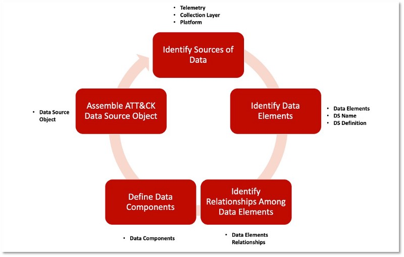
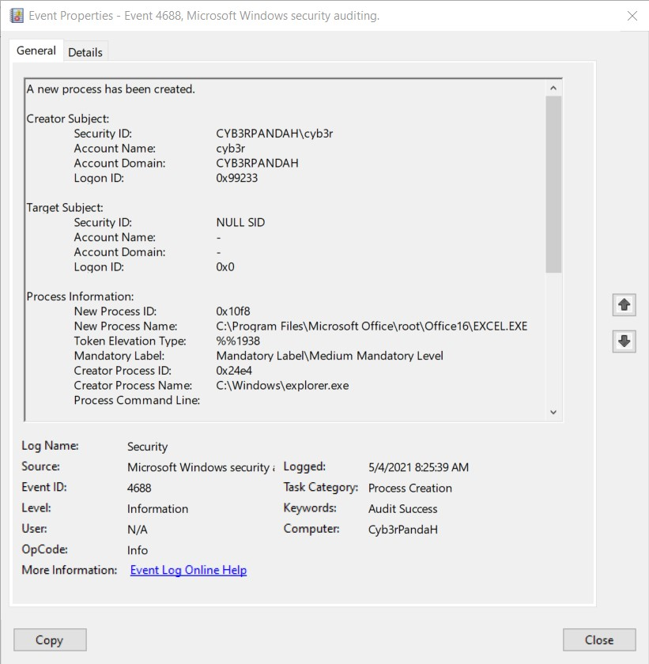
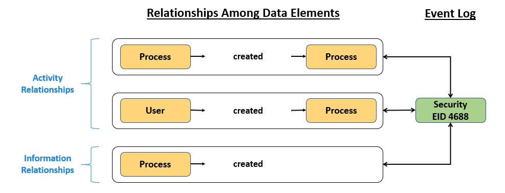
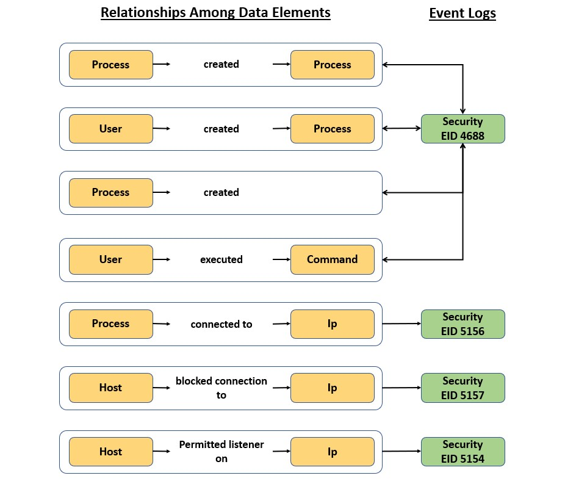
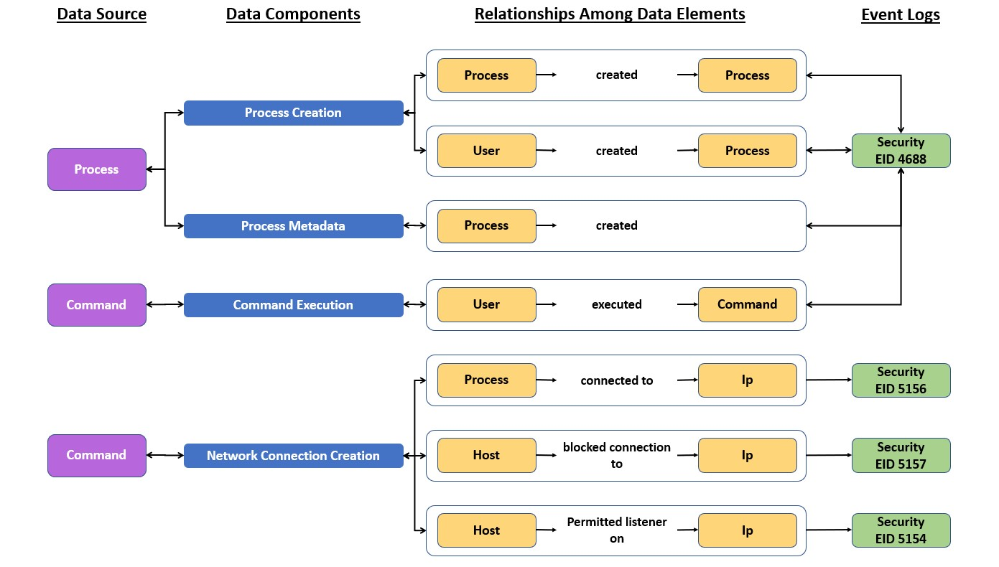
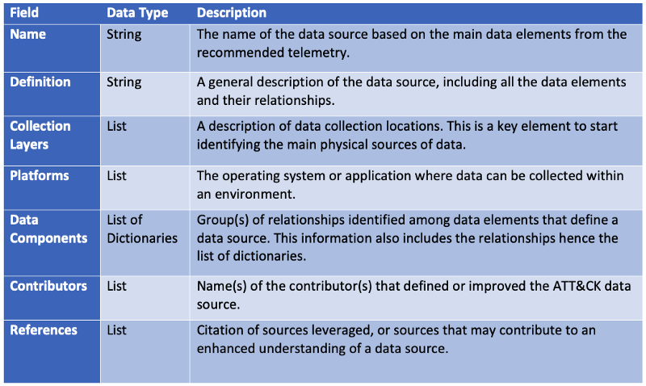

## **A Methodology to define Data Sources Objects**

The following methodology describes basic steps we followed in order to define ***data sources objects***. Even though this methodology considers the analysis of security telemetry, specific events' names or identification numbers (ids) are not listed within the information provided by ATT&CK. 

### **Identifying Sources of Data**
Documenting security telemetry collected within a network environment will provide us with data and information that should help us to answer to questions such as *why were these security events generated in my environment? (Activity)*, *what operating system supports its generation? (Platform)*, *where were they collected? (Collection Layer)*

Let's use security event *4688: A new process has been crated* provided by *Microsoft Windows security auditing* as a basic example to understand this step of the methodology. The action that triggered the generation of this event was the creation of a new process (Activity). This security event can be collected by using the built-in event logging application for devices that work with the Windows operating system (Platform). Because we are working with a built-in application, this security event was collected at the host level.

### **Identifying Data Elements**
Data elements help us not only to represent (elements) and describe (attributes) relevant network security concepts, but also to get a better understanding of the interactions (relationships) among them. There is a fundamental rule that we should consider when defining: **there is no one correct way to define data elements**. In other words, the definition of data elements and its attributes will depend on the reality of your organization.

Let's take a look at the *4688: A new process has been crated* security event again. Within the information provided by this event, we have identified network security concepts such as the [*user account*](https://github.com/mitre-attack/attack-datasources/blob/main/contribution/user_account.yml) that requested the creation of the [*process*](https://github.com/mitre-attack/attack-datasources/blob/main/contribution/process.yml), and we also have information of the process which ran the new process. This security event also provides metadata that can help us to describe our data elements. For instance, regarding the user account data element, we have information of its *Logon Id* and the *Domain* it belongs to. Regarding the process data element, we have information of its *Id* and *Token Elevation Type*.

The definition of data elements within the ATT&CK framework migh or might not align with the reality of your organization. However, as a [mid-level model (Figure 5)](https://attack.mitre.org/docs/ATTACK_Design_and_Philosophy_March_2020.pdf), you can use ATT&CK as a starting point and customize your definition of data elements.

### **Identifying Relationships Among Data Elements**
By documenting telemetry collected within a netork environment we were able to identify the activity that triggered the generation of security telemetry (*creation of a new process*) and data elements that were involved on this action (*user account* and *process*). Using these concepts as a reference, we can start describing interactions among data elements through relationships. The image below shows some of the relationships that we have identified so far:

We have categorized relationships in *activity* and *information*. Activity relationships are the ones that make reference to the action that triggered the generation of the security event. On the other hand, information relationships are the ones defined based on the metadata provided by the security event. As you can see in the image above, one event can give you security context for more than one relationship. What relationship(s) should we use? It will depend on the use case you are working on.

If we repeat all the steps described so far, we can start identifying different relationships among data elements based on different security events.

### **Defining Data Components**
As you can see in the image above, different relationships can be indentified based on information provided by security events. However, some of them describe the same security context. Therefore, we decided to group relationships that are related. *Data components* will help us to categorized relationships among data elements based on the security context they describe (*i.e. Creation, execution, deletion*) and the type of relationships (*Activity and Information*). The following image shows data components defined for the relationships that we have identified previously:

Even though relationships describe interactions among different data elements, grouping them throguh data components allowed us to identify main network security concepts that are described by collected security events such as *Process*, *Command*, and *Network Traffic*. These network security concepts will represent data sources that we can collect data and information from.

### **Assembling ATT&CK Data Source Objects**
During the development of this methodology we have identified data sources' context that can help us to describe the activity within a network environment. We have decided to formalize all this contex thorugh the definition of **Data Source Objects** within the ATT&CK Object Model. The objects' strcuture is represented in the following image:

